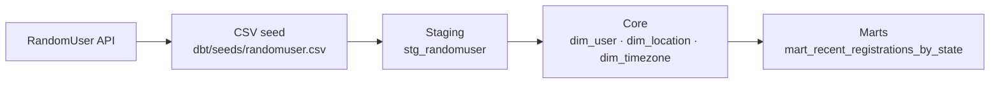

# randomuser_elt

A small ELT pipeline built for a Data Engineering technical assessment: extract user profile data from the [RandomUser API](https://randomuser.me/documentation), load it as a CSV seed, and normalize it with dbt into a tested, queryable SQLite warehouse — serving a specified selection: [the 3 most recently registered users per US state  (using a window function)](dbt/models/marts/mart_recent_registrations_by_state.sql).

## Pipeline Outline
 


As per the requirements, the two piplline segments:
1. **[Extract & Load](src/randomuser_elt/:)** A slim Python application to apply the parameters that get the required data from the [target API](https://randomuser.me/documentation) in CSV format, then write it directly to the seeds directory. Other than this the only responsibilities of this segment are applying URL parameters and  validating their datatypes and logging and transmitting errors. Pytest tests for this are in `tests/` (see **Testing & quality** below).
2. **[Transform](dbt/):** Seeding the SQLite database with the seed and the following testing, validation and transformation are all managed by `dbt` in these key steps:
    - **Seed -> Stage**: Seeding the database with a [staging view](dbt/models/staging/stg_randomuser.sql) from the API response CSV. The [staging model](dbt/models/staging/_staging.yml) applies uniquness and data consistency tests to prevent malformed data entering the database.
    - **Stage -> Core**: Building the database from the staging view in a simple 2nf pattern as 3 tables. Apply a macro for generating age from the dob and current date to generate warnings for stale age values in the raw API data.
    - **Core -> Marts**: [Model](dbt/models/marts/_marts.yml) and serve the [requested query](dbt/models/marts/mart_recent_registrations_by_state.sql) results. Results are filtered for United States users only and only the requested columns are selected. Actual age is presented in case of stale age values.

**Invoke: Simple controle surface** - to provide simple and easily replicateable commands and document them, use [Tasks](tasks.py) with 'invoke'. Run `invoke --list` for the full set with descriptions or see below. These commands also check for and initiate the SQLite DB before all relevant **dbt** processes, so the databse is present when needed.


## Setup

1. Sync dependencies and activate the virtual environment:
   ```bash
   uv sync

   source .venv/bin/activate  # Windows: .venv\Scripts\activate
   ```
2. Configure environment variables (defaults in `.env.example` already work out of the box — no secrets involved):
   ```bash
   cp .env.example .env

3. Install `dbt` packages (`dbt_utils`)
```bash
invoke deps
```

**Note:** `invoke debug` (`dbt debug` with flags) and `invoke parse` (same for `dbt parse`) are available for diagnosing connection/config issues before building the database with dbt.

## Running the pipeline

```bash
invoke extract   # Pull CSV from target API and load to directory dbt/seeds/
invoke seed      # load the seed CSV into SQLite
invoke build     # build every model + run every test, in DAG order
invoke results   # print the recent-registrations-by-state report
```

 `invoke clean` removes dbt's own build artifacts (`target/`, `dbt_packages/`, `logs/`); `invoke reset-db` deletes the SQLite database file itself so the next `seed`/`build` starts completely fresh.

All commands are `invoke` tasks (see `tasks.py`) rather than raw `dbt`/`uv` invocations, so `.env` loading and dbt project and profile path resolution are handled consistently, removing opportunity for failures. It also acts as a working documentation for necessary and commondly used commands.

## Viewing results

```bash
invoke results             # View mart_recent_registrations_by_state in terminal
invoke results --csv       # write the report to <table>.csv in the repo root
```

Only one report view is generated per run — `mart_recent_registrations_by_state` and the user has the option of writing it to the project root with  `--csv`.

The underlying data also lives in a plain SQLite file (`dbt/data/randomuser.db`) if you'd rather query it yourself — with any SQLite client, or e.g.:
```bash
sqlite3 dbt/data/randomuser.db ".headers on" ".mode column" "select * from mart_recent_registrations_by_state;"
```

## Testing & quality

```bash
python -m pytest              # unit tests + coverage (excludes the one live-API integration test by default)
python -m pytest -m integration   # the excluded live-API test, run explicitly
mypy                 # strict type checking
ruff check .          # linting
```

**Note:** Run tests as `python -m pytest`, not the bare `pytest` script — `python -m` prepends the repo root to `sys.path`, which `tests/test_tasks.py` needs to `import tasks` (a root-level module, outside `src/`); the bare `pytest` entry point doesn't add it and fails collection with `ModuleNotFoundError: No module named 'tasks'`.

**Coverage:** `pytest` enforces `--cov-fail-under=80` against `src/randomuser_elt`; current coverage is 100%. `tasks.py` (outside `src/`) has its own dedicated test file (`tests/test_tasks.py`) and is included in `mypy`'s checked files.

## Project layout

```
randomuser_elt/
├── src/randomuser_elt/     Extract + write pipeline (Python)
├── dbt/
│   ├── models/
│   │   ├── staging/        Typed pass-through of the raw seed
│   │   ├── core/           Normalized dimensions: dim_user, dim_location, dim_timezone
│   │   └── marts/          Presentation view: mart_recent_registrations_by_state
│   ├── macros/             age_in_years.sql — dob_date → whole years for drift-checking
│   ├── seeds/              randomuser.csv (gitignored) + _seeds.yml schema tests
│   ├── dbt_project.yml     Location flagged in invoke tasks
│   ├── profiles.yml        Locationn flagged in invoke tasks
│   └── packages.yml        dbt_utils
├── tests/                  pytest suite (unit + one integration test)
├── tasks.py                invoke task definitions & single entry point for commands
├── pyproject.toml
└── .env.example
```
